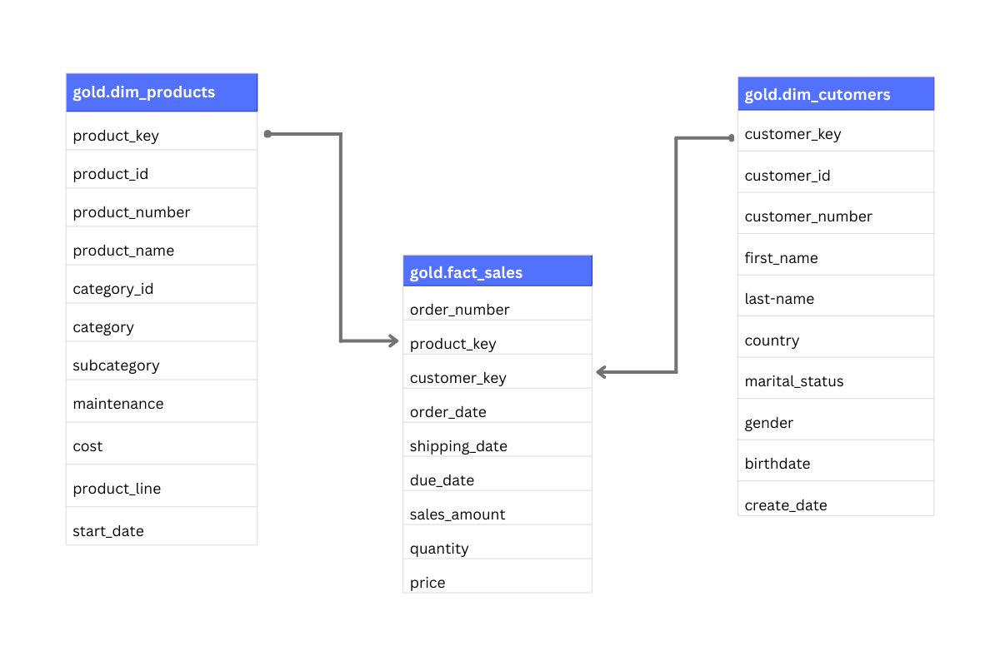
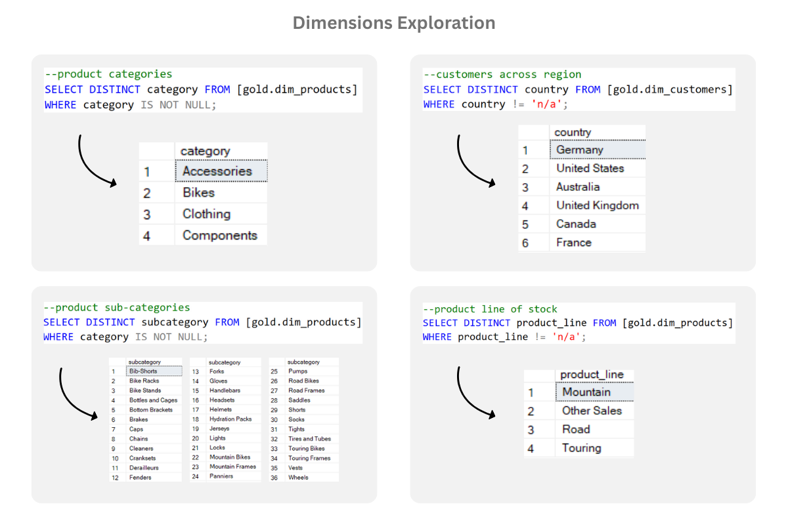
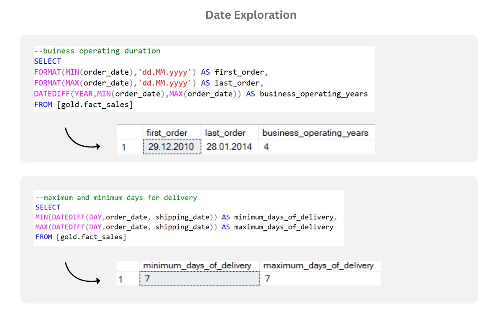
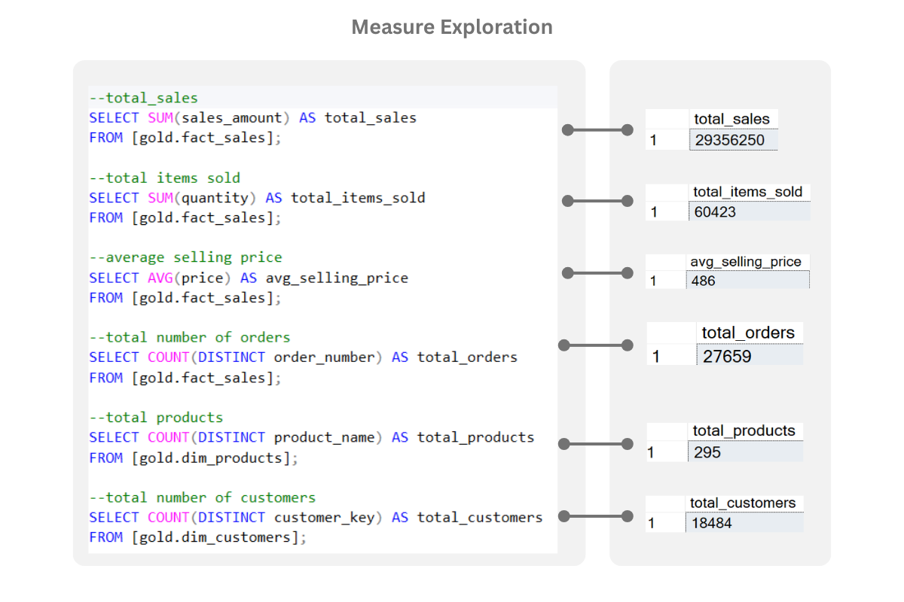

## Exploratory Data Analsysis on Retail Product Sales Dataset Using SQL
# OVERVIEW
This SQL-based Exploratory Data Analysis (EDA) project focuses on uncovering business insights from a retail sales dataset. The analysis is structured around:

* [Dimension Exploration:](#dimension-exploration) **Dimension Exploration:** Examining key categorical fields such as product categories, sub categories, product line, and regions.
* [Date Exploration:](#date-exploration) Calculating business operating duration and maximum/minimum days for delivery.
* [Measure Exploration:](#measure-exploration) Evaluating numerical fields like total sales, items sold, average selling price, total orders, products, and customers.
* [Key Metrics Report:](#key-metrics-report) Consolidated table of measure exploration.
* [Magnitude Analysis:](#magnitude-analysis) Analysing measures (customers by country, gender, etc) by categorical data.
* [Ranking Analysis:](#ranking-analysis) Extracting top product in most/least ordered category, highest/lowest revenue generating product, etc.

### ER DIAGRAM

# Dimension Exploration

 # Date Exploration:
 
 
 # Measure Exploration:
 
 
 # Key Metrics Report:
  
 # Magnitude Analysis:
 # Ranking Analysis:
